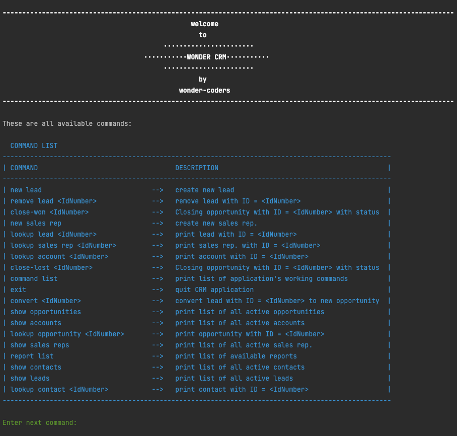
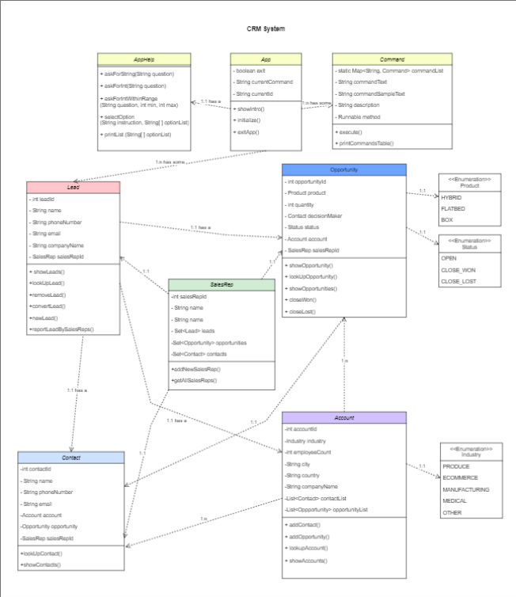

# WonderCoders Customer Relationship Management App

## How to use

This tool will make tracking prospective and existing customers through the sales process much easier for the companies.The App is ready to be used, just run the main file and the App will start working. It will first show the user a list of all the commands accepted and the user will just have to type whatever they want to do. The App will constantly ask the user for information and it will complete the request with the information given. Easy and simple!

<b> New features! </b>
In the upgraded version, a reporting feature is available. Companies will be able to receive useful information regarding their sales so that they can improve them!

### Image from the app:

### Use case diagram:

## Technical aspects

The application is entirely based on the App class and its initialize() method. This method initializes the application, sets a list of commands and asks the user for next command to execute. Every method nedded in the App is inside this list of commands.  

The methods contained in AppHelp class ask and receive information from the user or show information to the user.

Command class sets a series of attributes for each command, one of them being a Runnable. When a command is executed from App the runnable calls the corresponding methods in the needed service (lead / opportunity / account / contact / sales rep).

TextColor class contains a the methods to change and restore printed color.

Status enumeration is a list of the different status a opportunity can have.

Product enumeration sets the different types of products.

Industry enumeration contains the different types of industries available.

Color enumeration is a list of colors that can be used in the application.

The model package contains every entity needed to create the tables in the database, defining the relationships between them as we want them to be. There are 5 entities: Account, Contact, Lead, Opportunity and SalesRep. The models only contain the propperties, the constructors and the getters and the setters.

The repository package has all the repositories related to the models mentioned before, one per each of them. These help us communicate with our database and filter data as we need, thanks to the queries inside of them. 

Inside the service package are the methods we use to show the information, filtered depending the queries or not, inside the database and create or update data.

### Class diagram:

### DB model:

*This CRM was developed using java.*

A project by Núria Mafé, Olatz Izagirre, Paula Kamisato and Beatriz Pérez.

Link to our trello board : https://trello.com/b/csX2n0Ki/homework-3-wondercoders

